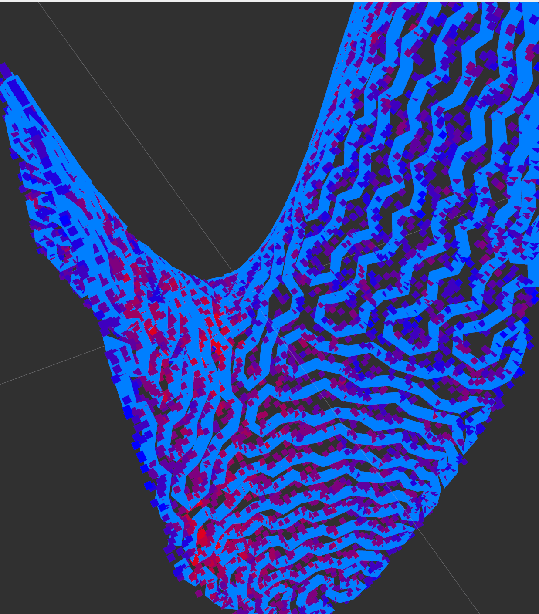

# Benchmarking 3D Coverage Path Planning (CPP)

<p align="center">
  <a href="https://ros.org/">
    
  </a>
  
  

> A unified, modular, and extensible benchmarking platform for 3D Surface Coverage Path Planning (CPP) algorithms.

> **Please Note**: The authors are still actively improving this evaluation platform, and the codebase may be subject to significant changes.

## Background

In robotics, particularly for tasks like cleaning, painting, and inspection on 3D surfaces, Coverage Path Planning (CPP) is critical. However, the lack of a unified evaluation standard makes it difficult to fairly compare the performance of different algorithms. This platform aims to address this challenge by providing a standardized environment to evaluate and compare various 3D CPP algorithms.

## Features

- 🌐 **Diverse Target Surfaces**: Supports importing various 3D model formats (e.g., STL, PCD) as coverage targets.
- 🧩 **Modular Algorithm Framework**: Provides a standard interface to easily integrate and evaluate different path planning algorithms.
- 🤖 **Configurable Robot Models**: Allows users to define and switch between different robot sensing (collision) models to simulate real-world physical constraints.
- ⚙️ **Standardized Pre-processing**: Encourages algorithm authors to implement their own pre-processing steps (e.g., cellular decomposition) and seamlessly integrate them into the evaluation pipeline.

## Dependencies

### Required

- **ROS 2 (Humble)**
- **Open3D 0.18.0 (C++ version)**
  
  - **Important**: Please do not use `pip install open3d`. You must compile the C++ library from source.
- **Eigen3**
  
  ```bash
  sudo apt-get install libeigen3-dev
  ```
- **GLFW3**
  
  ```bash
  sudo apt install libglfw3 libglfw3-dev
  ```

- **TBB**

  ```bash
  sudo apt-get install libtbb-dev
  ```

### Recommended

- **CUDA (e.g., 11.8)** for accelerated computation.

## Quick Start

The following steps will guide you through a complete evaluation process.

### Create workspace, Clone, and Build

```
mkdir -p ~/benchmark_ws/src
cd ~/benchmark_ws/src
git clone https://github.com/ZJUTongYang/benchmarking_3dcpp.git
git clone https://github.com/ZJUTongYang/nuc_ros2.git # an example algorithm to be evaluated
cd ~/benchmark_ws
colcon build
source install/setup.bash
```

### Prepare the Surfaces

Copy the STL or PCD file you wish to evaluate into the benchmarking_3dcpp/scene/ directory. We currently provide an example file, remeshed_saddle.stl.

### Prepare the Algorithms

Git clone the algorithms you want to evaluate, and make sure that they are launched before this platform.

### Register the Surfaces and Algorithms

Open the benchmarking_3dcpp/config/config.yaml and modify as per instruction inside the file

### Build

Whenever you modify the config file, the code, or add new surfaces, don't forget to re-compile.

```
cd ~/benchmark_ws
colcon build
```

### Run

The following command will launch the NUC algorithm and the platform.

```
ros2 launch benchmarking_3dcpp eval.launch.py
```

After a while, you will get results like:

```
[benchmarking_3dcpp_node-2] We create task 0, robot: circular, scene: remeshed_saddle, algorithm: Yang2023Template
[benchmarking_3dcpp_node-2] We create task 1, robot: line_lidar, scene: remeshed_saddle, algorithm: Yang2023Template
[benchmarking_3dcpp_node-2] We finish scheduling 2 tests. 
[benchmarking_3dcpp_node-2] We start executing NUC
[benchmarking_3dcpp_node-2] the platform enters callback
[benchmarking_3dcpp_node-2] Finish executing NUC with computation time 0.00143915s.
[benchmarking_3dcpp_node-2] We have CUDA
[benchmarking_3dcpp_node-2] Coverage evaluation time: 0.00273326s
[benchmarking_3dcpp_node-2] Coverage statistics: 
[benchmarking_3dcpp_node-2]   Coverage ratio: 96.3958%
[benchmarking_3dcpp_node-2]   Max coverage count: 7
[benchmarking_3dcpp_node-2]   Average coverage count: 2.39867
[benchmarking_3dcpp_node-2] Saved to "/home/yt/benchmark_ws/install/benchmarking_3dcpp/share/benchmarking_3dcpp/output/circular_remeshed_saddle_Yang2023Template.h5"
[benchmarking_3dcpp_node-2] We start executing NUC
[benchmarking_3dcpp_node-2] the platform enters callback
[benchmarking_3dcpp_node-2] Finish executing NUC with computation time 0.00121628s.
[benchmarking_3dcpp_node-2] We have CUDA
[benchmarking_3dcpp_node-2] Coverage evaluation time: 0.302065s
[benchmarking_3dcpp_node-2] Coverage statistics: 
[benchmarking_3dcpp_node-2]   Coverage ratio: 0.0790389%
[benchmarking_3dcpp_node-2]   Max coverage count: 1
[benchmarking_3dcpp_node-2]   Average coverage count: 0.000790389
[benchmarking_3dcpp_node-2] Saved to "/home/yt/benchmark_ws/install/benchmarking_3dcpp/share/benchmarking_3dcpp/output/line_lidar_remeshed_saddle_Yang2023Template.h5"
```

### Visualize the result

Now the evaulation hdf5 file has been store in the shared folder of the benchmarking platform. Launch a viz node and provide it with the file name.

```
ros2 launch benchmarking_3dcpp viz.launch.py # rviz2 will be also launched here
ros2 topic pub -1 /load_and_visualize_h5 std_msgs/msg/String "'data': 'circular_remeshed_saddle_Yang2023Template.h5' "
```

Ensure that the Fixed Frame in Rviz2 is set to world. Then, add the display topics "/path_visualization" and "surface_pointcloud". You should see visualizations in Rviz2 like: 




## Citation

If you use our benchmarking platform in your research, please consider citing our related paper:

```
@article{Yang2023Template,
title={Template-Free Nonrevisiting Uniform Coverage Path Planning on Curved Surfaces},
author={Yang, Tong and Miro, Jaime Valls and Nguyen, Minh and Wang, Yue and Xiong, Rong},
journal={IEEE/ASME Transactions on Mechatronics},
year={2023},
volume={28},
number={4},
pages={1853--1861},
publisher={IEEE}
}
```

